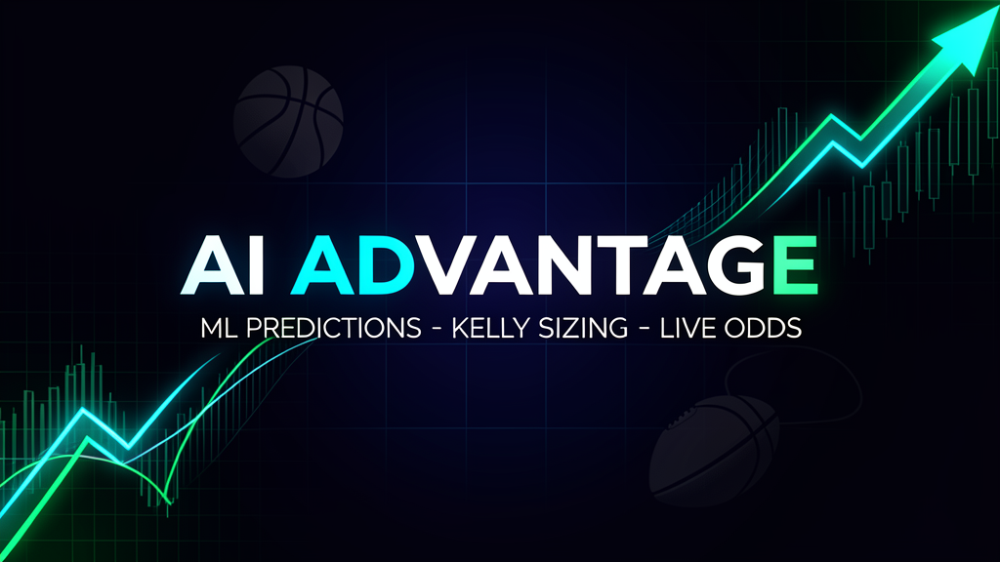

# AI Advantage Sports



[](https://aiadvantagesports.com)
[](https://reactjs.org/)
[](https://www.typescriptlang.org/)
[](https://tailwindcss.com/)

> ML-driven sports betting product: predictions, Kelly-based bet sizing, live odds, and a real subscription surface. Live at **[aiadvantagesports.com](https://aiadvantagesports.com)**.


## Why this exists

Most "AI betting" projects stop at a notebook. This one ships.

AI Advantage turns model output into a decision a user can actually act on:

- **Predict** — model-driven picks across NBA, NFL, and MLB
- **Size** — Kelly-based stake recommendations that protect bankroll
- **Time** — live odds and line-movement views to catch value before the market adjusts
- **Monetize** — premium tier with real Stripe checkout, not a fake paywall

It's the product layer of a larger sports-analytics stack — the modeling lives in adjacent repos, this is where it meets a user.

## Feature tour

| Area | What it does |
|------|--------------|
| Game analyzer | Enter a matchup, get an analysis and a recommendation |
| Live odds | Track lines and movement across the slate |
| Kelly sizing | Translate edge + bankroll into a stake |
| Multi-sport | NBA, NFL, MLB workflows |
| Premium | Stripe subscription + one-time checkout |
| Newsletter | Notion-backed capture wired into Substack |

## Stack

`React` · `TypeScript` · `Vite` · `Tailwind CSS` · `shadcn/ui`

Netlify Functions handle Stripe checkout, newsletter capture, and the shared execution ledger so previews and production stay fully functional.

## Run it locally

```bash
git clone https://github.com/ianalloway/ai-advantage.git
cd ai-advantage
npm install
npm run dev
```

Open `http://localhost:8080`.

## Deployment

- `netlify.toml` — Netlify SPA deploy + serverless functions (`netlify/functions`)
- `api/` — shared server-side handlers (Stripe checkout, newsletter capture, execution ledger) wrapped by `netlify/functions`

### Stripe (server flow)

```bash
STRIPE_SECRET_KEY=***
STRIPE_PREMIUM_PRICE_ID=price_...
STRIPE_ONE_TIME_PRICE_ID=price_...
PUBLIC_APP_URL=https://your-domain
```

If unset, the app falls back to static Stripe Payment Links via `VITE_STRIPE_CHECKOUT_URL` and `VITE_STRIPE_ONE_TIME_CHECKOUT_URL`.

### Newsletter capture

The homepage form posts to `/api/newsletter-subscribe`, which creates a Notion entry, emails a notification, and redirects into the Substack subscribe flow.

```bash
NOTION_API_KEY=***
NOTION_PARENT_PAGE_ID=...
RESEND_API_KEY=re_...
RESEND_FROM_EMAIL="AI Advantage <onboarding@yourdomain.com>"
NOTIFY_EMAIL=ian@allowayllc.com
SUBSTACK_PUBLICATION_URL=https://allowayai.substack.com
```

## Where the modeling lives

| Repo | Role |
|------|------|
| [sports-betting-ml](https://github.com/ianalloway/sports-betting-ml) | Models — logistic regression, XGBoost, ensembles |
| [nba-ratings](https://github.com/ianalloway/nba-ratings) | Ratings + win-probability library |
| [kelly-js](https://github.com/ianalloway/kelly-js) | Kelly / odds / bankroll math (TS) |

## Author

**Ian Alloway** — [Portfolio](https://ianalloway.xyz) · [LinkedIn](https://www.linkedin.com/in/ianit) · [Writing](https://allowayai.substack.com)

## License

Proprietary. All rights reserved.
