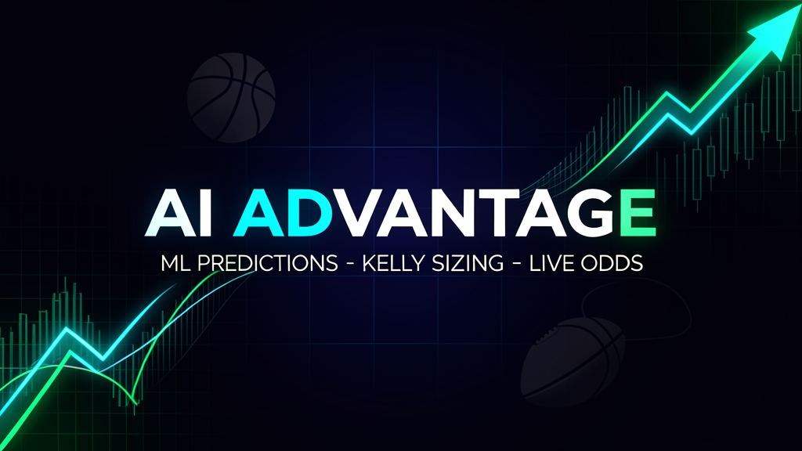

# AI Advantage Sports



[](https://aiadvantagesports.com)
[](https://github.com/ianalloway/ai-advantage/actions/workflows/ci.yml)
[](https://react.dev/)
[](https://www.typescriptlang.org/)
[](https://vitejs.dev/)
[](https://tailwindcss.com/)
[](LICENSE)

> ML-driven sports betting product: predictions, Kelly-based bet sizing, live odds, and a real subscription surface. Live at **[aiadvantagesports.com](https://aiadvantagesports.com)**.


## Why this exists

Most "AI betting" projects stop at a notebook. This one ships.

AI Advantage turns model output into a decision a user can actually act on:

- **Predict** — model-driven picks across NBA, NFL, and MLB
- **Size** — Kelly-based stake recommendations that protect bankroll
- **Time** — live odds and line-movement views to catch value before the market adjusts
- **Monetize** — premium tier with real Stripe checkout, not a fake paywall

It's the product layer of a larger sports-analytics stack — the modeling lives in adjacent repos, this is where it meets a user.

**Stack layering:** [nba-ratings](https://github.com/ianalloway/nba-ratings) (Python ratings / win-prob) → [kelly-js](https://github.com/ianalloway/kelly-js) (TypeScript Kelly / odds math) → [sports-betting-ml](https://github.com/ianalloway/sports-betting-ml) (training / value-bet demo) → **ai-advantage** (live product).

## Feature tour

| Area | What it does |
|------|--------------|
| Game analyzer | Enter a matchup, get an analysis and a recommendation |
| Live odds | Track lines and movement across the slate |
| Kelly sizing | Translate edge + bankroll into a stake |
| Fair price | De-vigs the market, shows the no-vig line, book hold, and the edge that survives it |
| Hedge desk | Prices a live ticket against the other side: lock stake, guaranteed profit, lock-vs-ride verdict |
| Model calibration | Brier score and reliability bands over the graded ledger — are the probabilities honest? |
| Calibrated sizing | Corrects the model's probability by its measured bias before Kelly sizes the stake |
| Parlay desk | Prices a multi-leg ticket: compounded hold, leg correlation, and whether the legs are better bet straight |
| Bet log | Your actual tickets — realised P&L, price taken vs the board's quote, and CLV |
| Staking replay | The same graded history under flat, percent, and Kelly disciplines, calibrated walk-forward |
| Edge attribution | Where the return comes from by sport, edge band, side, and timing — thin samples marked |
| Slate outlook | Correlated Monte Carlo of tonight's sized slate over a month: spread, drawdown, risk of ruin |
| Significance | Exact binomial test on the graded ledger — could a break-even bettor have done this by luck? |
| Close forecast | Projects the closing price from a drift fitted on the archive, and says take it or wait |
| Lines in points | Model vs market as a spread, plus how far the model can be wrong and still be +EV |
| Live win probability | In-game pricing from the lead and the clock, with live edge against the live number |
| Market self-check | Moneyline against posted spread — when they disagree, one of them is stale |
| Model vs the price | The blend of model and market that forecast best, judged on rows it never saw |
| Portfolio risk | Correlated exposure by team, game, sport, and narrative, with a stake haircut |
| Multi-sport | NBA, NFL, MLB workflows |
| Premium | Stripe subscription + one-time checkout |
| Newsletter | Notion-backed capture wired into Substack |

## Stack

`React 19` · `TypeScript` · `Vite 8` · `Tailwind CSS` · `shadcn/ui` · `Netlify Functions`

Netlify Functions handle Stripe checkout, newsletter capture, and the shared execution ledger so previews and production stay fully functional. Live product: **[aiadvantagesports.com](https://aiadvantagesports.com)**.

## Run it locally

```bash
git clone https://github.com/ianalloway/ai-advantage.git
cd ai-advantage
npm install
npm run dev      # http://localhost:8080
npm test         # unit tests (vitest)
npm run build    # production build + prerender
```

Copy `env.example` → `.env.local` for Stripe / newsletter / auth secrets when exercising server flows.

## Deployment

- `netlify.toml` — Netlify SPA deploy + serverless functions (`netlify/functions`)
- `api/` — shared server-side handlers (Stripe checkout, newsletter capture, execution ledger) wrapped by `netlify/functions`

### Stripe (server flow)

```bash
STRIPE_SECRET_KEY=sk_...
STRIPE_PREMIUM_PRICE_ID=price_...
STRIPE_ONE_TIME_PRICE_ID=price_...
STRIPE_WEBHOOK_SECRET=whsec_...
STRIPE_TRIAL_DAYS=7
PUBLIC_APP_URL=https://aiadvantagesports.com
AUTH_SECRET=...            # dedicated value, not a borrowed credential
AUTH_SECRET_PREVIOUS=...   # optional; old secrets still accepted, re-hashed on login
```

Webhook endpoint: `https://aiadvantagesports.com/.netlify/functions/stripe-webhook`  
Events: `checkout.session.completed`, `checkout.session.async_payment_succeeded`, `customer.subscription.created|updated|deleted`.

Paid access is **server-truth only** (`/api/entitlements/me`). localStorage is a cache and cannot unlock Pro.

An email address never unlocks a purchase by itself (signup does not verify email). A purchase reaches an account through the signed-in checkout, through the purchase cookie in the buying browser, or through a single-use restore link emailed to the purchase address (`/api/recover-purchase`, Profile → "Already paid?"; needs `RESEND_*` and `PUBLIC_APP_URL`).

Checkout includes a `STRIPE_TRIAL_DAYS` trial on Pro Monthly. Customer Portal: `/api/create-portal-session` (enable in Stripe Dashboard → Settings → Billing → Customer portal). Funnel events: `checkout_started` → `checkout_paid` → `d7_retained` → `cancel_reason` via `/api/funnel`. Hourly edge-alert emails: `send-edge-alerts` (needs `RESEND_*`).

**Deploy step (once, for the release that removed email-based entitlement lookup):**
accounts used to reach any purchase made with their email. To keep exactly the
access that existed at deploy time, run the legacy binding migration with the
deploy's timestamp as the cutoff, review the dry run, then apply it. Rows with
`accountPredatesPurchase: true` are the ones worth a look (an account that
existed before a guest purchase with its email could be a squat); pass their
`entitlementId`s in `exclude` to skip them. Requires `ADMIN_API_TOKEN`.

```bash
CUTOFF=2026-10-09T18:00:00Z   # when the release went live
curl -s -X POST https://aiadvantagesports.com/api/admin-entitlements \
  -H "Authorization: Bearer $ADMIN_API_TOKEN" -H "Content-Type: application/json" \
  -d "{\"action\":\"plan-legacy-email\",\"cutoff\":\"$CUTOFF\"}" | jq
curl -s -X POST https://aiadvantagesports.com/api/admin-entitlements \
  -H "Authorization: Bearer $ADMIN_API_TOKEN" -H "Content-Type: application/json" \
  -d "{\"action\":\"apply-legacy-email\",\"cutoff\":\"$CUTOFF\",\"exclude\":[]}" | jq
```

It is idempotent. Support can bind one purchase to an account with
`{"action":"bind","userId":"…","entitlementId":"…"}`; it never moves a purchase
already bound to another account.

Strict read-only configuration gate:
`READINESS_BASE_URL=https://aiadvantagesports.com npm run test:readiness`.
This requires every billing readiness flag; the existing health smoke remains permissive.
See [billing readiness and mock journeys](docs/billing-readiness.md) for coverage,
commands, and the distinction between mocked tests and live payment verification.

Inspect flags: `curl -s https://aiadvantagesports.com/api/billing-status | jq`

Production does **not** fall back to Payment Links when Checkout Sessions fail (that orphaned access).

### Newsletter capture

The homepage form posts to `/api/newsletter-subscribe`, which creates a Notion entry, emails a notification, and redirects into the Substack subscribe flow.

For publishing *into* Substack (posting content, as opposed to capturing subscribers), see [`docs/hermes-substack.md`](docs/hermes-substack.md) — a standalone script the Hermes agent runs to push posts to `allowayai.substack.com`.

```bash
NOTION_API_KEY=***
NOTION_PARENT_PAGE_ID=...
RESEND_API_KEY=re_...
RESEND_FROM_EMAIL="AI Advantage <onboarding@yourdomain.com>"
NOTIFY_EMAIL=ian@allowayllc.com
SUBSTACK_PUBLICATION_URL=https://allowayai.substack.com
```

## Where the modeling lives

| Repo | Role |
|------|------|
| [nba-ratings](https://github.com/ianalloway/nba-ratings) | Ratings + win-probability library (PyPI: `nba-edge`) |
| [kelly-js](https://github.com/ianalloway/kelly-js) | Kelly / odds / bankroll math (TS; npm publish pending) |
| [sports-betting-ml](https://github.com/ianalloway/sports-betting-ml) | Training / value-bet Streamlit demo (synthetic metrics) |

## Author

**Ian Alloway** — [Portfolio](https://ianalloway.xyz) · [LinkedIn](https://www.linkedin.com/in/ianit) · [Writing](https://allowayai.substack.com)

## License

MIT — see [LICENSE](LICENSE). This commercial product is open-sourced for portfolio transparency.
